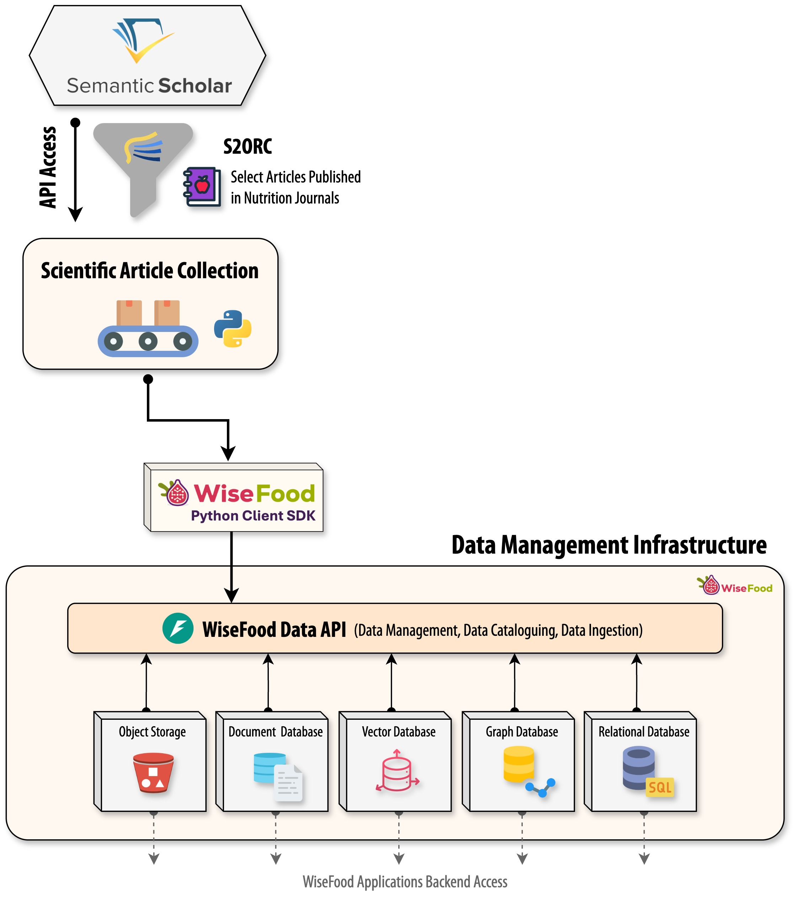

# WiseFood Data Sources & Data Preparation

Overview of the end-to-end data preparation and integration pipeline that powers the WiseFood knowledge assets. This synopsis is tailored for an academic/European review context, emphasizing methodological rigor, traceability, and semantic interoperability.

## Purpose and objectives
📚 Curate a high-quality, continually refreshed corpus of nutrition-related scientific literature from large open datasets.  
🧭 Standardize and enrich content so it can be searched semantically, linked in a knowledge graph, and exposed securely to downstream applications.  
🧪 Provide programmatic entrypoints (API + SDK) with clear separation of concerns for acquisition, processing, storage, and access control.  

## Repository layout
- `scientific-article-collection/`: acquisition and filtering pipelines for S2ORC/SCOPUS with Semantic Scholar enrichment and venue fuzzy matching; supports full downloads and incremental diffs.
- `wisefood-data-api/`: FastAPI data catalog backed by Elasticsearch, Neo4j (relations), MinIO (binary/object storage), Keycloak (identity), and Redis (caching).
- `wisefood-client/`: Python SDK for authenticated ingestion and querying of API entities.

## Pipeline (end-to-end)
1) **Acquisition and provenance**  
   - Pull S2ORC shards via `download_s2orc.sh`; maintain SCOPUS venue lists as reference.  
   - Retrieve authoritative IDs from Semantic Scholar (`store_api_ids.py`) to anchor subsequent filtering; logs and source versions can be retained for audit trails.
2) **Filtering and quality controls**  
   - Apply fuzzy venue matching (`match_journals.py`) and deduplication to reduce false positives.  
   - Filter articles by ID or venue (`filtering_by_id.py`, `filtering.py`), outputting JSONL/CSV for metadata and full-text slices suitable for catalog ingestion.  
   - Manual validation is supported through generated alias maps (`venue_aliases.json`) to tighten precision/recall.
3) **Incremental maintenance**  
   - Process S2ORC diffs (`download_diffs.py`, `update_nutrition_articles.py`) to keep the corpus synchronized with upstream releases; designed to be interruptible so partial runs still yield usable subsets.
4) **Catalog ingestion**  
   - Load processed items into the data catalog using the API or `wisefood-client`.  
   - Text embeddings are created with `sentence-transformers/all-MiniLM-L6-v2` and stored in Elasticsearch for semantic search; relationships are mirrored in Neo4j; optional MinIO stores binaries alongside metadata.
5) **Serving, security, and interoperability**  
   - FastAPI routes expose CRUD/search across articles, guides, artifacts, organizations, and fact tables (`/api/v1/*`).  
   - Keycloak issues and validates tokens; Redis can cache responses; environment variables configure all endpoints and credentials (see `wisefood-data-api/src/main.py`).